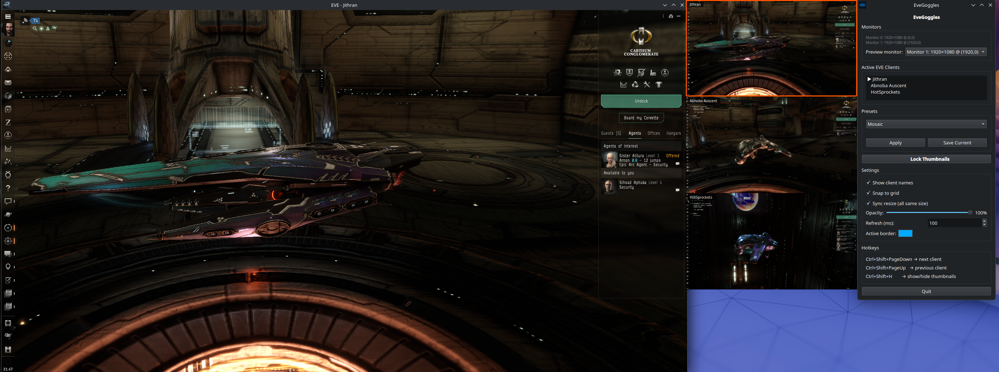

# EveGoggles

A Linux-native multi-client window manager for EVE Online

 — a direct replacement for the Windows-only [eve-o-preview](https://github.com/Phrynohyas/eve-o-preview) tool.

If you multibox EVE on Linux and want live thumbnail previews of your other clients that you can click to switch between, this is for you.

---

## Is this for me?

| | Supported |
|---|---|
| **OS** | Linux (X11 or XWayland) |
| **Desktop** | GNOME, KDE, XFCE — any X11-compatible environment |
| **Wayland** | Supported via XWayland (EVE and EveGoggles both run through XWayland) |
| **Native Wayland** | Not supported |
| **EVE client** | Any EVE Online client running on Linux (Wine/Proton or native launcher) |
| **Monitors** | Single or multi-monitor — preview monitor is configurable |

> **Not applicable if:** you are on Windows (use eve-o-preview), macOS, or a pure Wayland compositor with no XWayland support.

---

## Features

- **Live thumbnail previews** of all open EVE clients, refreshed in the background
- **Click to switch** — click any thumbnail to bring that client to the foreground
- **Always on top** — thumbnails float above fullscreen EVE windows so they are always reachable
- **Active client highlight** — a coloured border marks the currently focused client
- **Two layout presets:**
  - **Stacked** — a vertical column (25% of the screen width) on one monitor, leaving the rest free for a browser or other tools
  - **Mosaic** — fills the entire preview monitor with thumbnails; automatically picks the best grid (2×2, 3×2, 3×3, …) based on how many clients are open
- **Auto-layout on client change** — when you open or close an EVE client the layout is recalculated automatically
- **Drag & drop** — move any thumbnail freely; snaps to a configurable grid
- **Resize** — drag the bottom-right corner to resize
  - Hold **Ctrl** while resizing to lock the aspect ratio
  - All thumbnails resize together (toggleable)
- **Lock mode** — lock all thumbnails in place; click still switches clients, drag is disabled
- **Opacity control** — set thumbnail transparency (20–100%)
- **Configurable refresh rate** — default 200 ms, adjustable down to 50 ms
- **Global hotkeys** (work while EVE is focused):
  - `Ctrl+Shift+PageDown` — switch to next client
  - `Ctrl+Shift+PageUp` — switch to previous client
  - `Ctrl+Shift+H` — show/hide all thumbnails
- **System tray icon** for quick access
- **Saves layout** between sessions

---

## Requirements

### System packages

| Package | Purpose |
|---|---|
| `python3` (3.10+) | Runtime |
| `python3-pip` / `python3-venv` | Python environment |
| `ImageMagick` | Fallback window capture |
| `xdotool` | Window activation |
| `wmctrl` | Window management |
| `gcc`, `python3-devel` | Building Python extensions |

### Python packages (installed automatically)

- `PyQt6` — GUI framework
- `python-xlib` — X11 window discovery and hotkeys
- `ewmh` — Extended Window Manager Hints
- `Pillow` — Image processing
- `python-mss` *(optional)* — faster screen capture if available

---

## Installation

```bash
git clone https://github.com/Jithran/EveGoggles.git
cd EveGoggles
./install.sh
```

The installer will:
1. Install system packages via `dnf` (Fedora/RHEL) or `apt` (Ubuntu/Debian)
2. Create a Python virtualenv in `.venv` and install all Python dependencies
3. Create a `.desktop` entry so EveGoggles appears in your application menu

---

## Running

```bash
./evegoggles.sh
```

Or launch **EveGoggles** from your application menu after running the installer.

> The launcher forces `QT_QPA_PLATFORM=xcb` so Qt uses the X11 backend. This is required — native Wayland does not support the window positioning and global hotkey APIs that EveGoggles depends on.

---

## Usage

1. Start EveGoggles before or after opening your EVE clients — it will detect them automatically.
2. Open the **Control Panel** (appears on launch; also accessible from the system tray icon).
3. Select a preset (**Stacked** or **Mosaic**) and click **Apply**.
4. Thumbnails appear on your configured preview monitor. Click any thumbnail to switch to that client.
5. Use `Ctrl+Shift+H` to hide/show thumbnails when you need the screen space.

### Control Panel overview

| Section | Options |
|---|---|
| **Monitors** | Shows detected monitors; select which monitor to display previews on |
| **Active EVE Clients** | Lists all detected clients with the active one highlighted |
| **Presets** | Apply a layout preset; save your current layout as a new preset |
| **Settings** | Opacity, refresh rate, active border colour, snap to grid, sync resize, show client names |
| **Hotkeys** | Reference for all keyboard shortcuts |

---

## Configuration

Settings are saved automatically to `~/.config/evegoggles/config.json`. Thumbnail positions are also saved between sessions.

Custom presets are saved to `~/.config/evegoggles/presets/`.

---

## How it works

EveGoggles uses **python-xlib** and **EWMH** to discover all windows whose title matches `EVE - ` (the standard EVE client title format). It captures each window using `XGetImage` in a background thread and displays the results as scaled thumbnails in small frameless PyQt6 windows. Global hotkeys are implemented via `XGrabKey` so they work even when EVE has focus.

---

## Troubleshooting

**No clients detected**
Make sure your EVE client windows have `EVE - ` in their title (the default for the official launcher). Check that `xdotool` and `wmctrl` are installed.

**Thumbnails not on top of EVE**
EveGoggles uses `X11BypassWindowManagerHint` to float above fullscreen windows. If thumbnails still disappear behind EVE, make sure both applications are running under the same X server (XWayland or native X11).

**Hotkeys not working**
Another application may have grabbed the same key combination. Check for conflicts with your desktop environment's own shortcuts.

**Black thumbnails**
The XComposite capture fallback requires a compositing window manager. Most modern Linux desktops (GNOME, KDE) have this enabled by default.

---

## License

MIT
